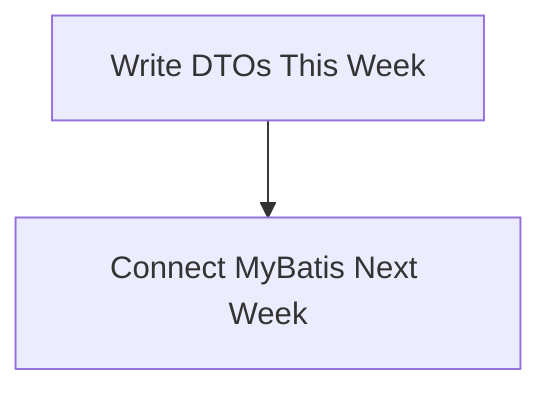
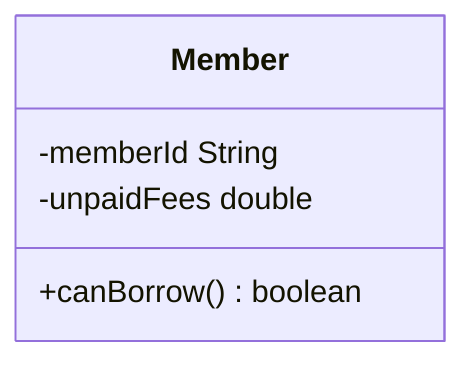

```mermaid
flowchart TD
    A[Write DTOs This Week] --> B[Connect MyBatis Next Week]
```
Important explanations go here

```mermaid
classDiagram
class Member {
  -memberId String 
  -unpaidFees double
  +canBorrow() boolean
}
```

